# Diggles Dog Spa

Developer: Chris Diggle

- [Live Site](https://diggles-dog-spa-4e32378de2f2.herokuapp.com/)
- [GitHub Repo](https://github.com/chrisdiggle1/diggles-dog-spa)

## Table of Content

- [Diggles Dog Spa](#diggles-dog-spa)
  - [Table of Content](#table-of-content)
  - [Introduction](#introduction)
    - [Project Goals](#project-goals)
    - [Data Base Design (ERD)](#data-base-design-(erd))
  - [User Experience - UX](#user-experience-ux)
    - [Strategy](#strategy)
    - [Scope](#scope)
    - [Structure](#structure)
    - [Skeleton](#skeleton)
    - [Surface](#surface)
  - [Agile Development](#agile-development)
  - [Current Features](#current-features)
  - [Future Features](#future-features)
  - [Technologies Used](#technologies-used)
    - [Languages](#languages)
    - [Python Packages](#python-packages)
    - [Frameworks & Tools](#frameworks--tools)
  - [Testing and Validation](#testing-and-validation)
  - [Deployment & Development](#deployment--development)
  - [Credits](#credits)
    - [Media](#media)
    - [Code](#code)
  - [Acknowledgements](#acknowledgements)

## Introduction

Welcome to Diggles Dog Spa, a fictitious luxury grooming and spa service created for my 4th Code Institute project. Diggles Dog Spa is designed to provide an exceptional pampering experience for dogs of all sizes and breeds. Our website serves as the primary platform for dog owners to explore our wide range of services, book and edit appointments, and stay updated with the latest in canine care and luxury grooming.

The project was designed as the 4th portfolio project of the Code Institutes Full Stack Diploma Program. It was built using Django, Python, JS, CSS, and HTML. The data is stored in a PostgreSQL database created by Code Insitute.

### Project Goals

The goal of the project was to build a webiste for dog owners to effortlessly book, edit and cancel appointments through a user-friendly interface ensuring a seamless experience for dog owners. For an administrator I have built a dashboard for approving or rejecting bookings, as well as adding and removing new services to the site to keep the spa's offerings current and responsive to clients needs. I want the project to provide exceptional service management and a pleasant experience for dog owners and site administrators.

### Data Base Design (ERD)

The The Entity Relationship Diagram (ERD) illustrates the structure of the database which lies at the core of the functionality of the site:

## User Experience - UX

### Strategy

#### Target Audience

The target audience is for dog owners seeking an easy and effeicient way to book there their dog in for grooming appointments. This is for customers looking for a hassle-free online experience to access a variety of grroming treatments, from basic hygiene maintenance to luxurious pampering sessions for their dogs. The customers appreciate the ability to create a persoanl account form managing appointments and tracking their dog's grooming history. Our service is designed for those who see their pets as family members and are committed to their well-being and appearence.

| EPIC                       | ID  | User Story |
| -------------------------- | --- | -----------|
| **CONTENT AND NAVIGATION** |     |            |
|                            | 1A  | As a site visitor I can view the site menu so that easily navigate through the site. |
|                            | 1B  | As a site visitor I can see the relevant information so that I can decide if I want to register for an account and become a customer. |
|                            | 1C  | As a site visitor I can access different pages on the site so that I can smoothly navigate through the functionality of the site. |
|                            | 1D  | As a customer I can view detailed information about each grooming service so that I can make a decision on what service I would like my dog to have. |
|                            | 1E  | As a site visitor I can click and view the sites social media so that I can view more information via social media. |
| **REGISTRATION AND USER ACCOUNTS** |     |            |
|                            | 2A  | As a customer I can create an account so that I can book my dog in for different grooming services. |
|                            | 2B  | As a customer I can use my created account information so that I can log into my account and access my information. |
|                            | 2C  | As a customer I can log out of my account so that my personal information is protected. |
| **MANAGING BOOKINGS**      |     |           |
|                            | 3A  | As an authenticated user I can book a grooming service for my dog so that my dog can receive professional grooming care. |
|                            | 3B  | As an authenticated user I can cancel a booking so that The booking is cancelled if we can no longer make it. |
|                            | 3C  | As an authenticated user I can edit my booking so that I can make amendments if I create a booking with a mistake. |
|                            | 3D  | As a customer I can go straight to the booking page if I see a service I like so that I don't have to close the service card and navigate to another page. |
|                            | 3E  | As a Developer I need to have validation on bookings so that we don't end up with double bookings. |
|                            | 3F  | As a Developer I need to have validation on bookings so that users can't accidentally book appointments on past dates. |
| **ADMIN CAPABILITIES**     |     |           |
|                            | 4A  | As an admin I can view, confirm, and cancel bookings so that I can manage the grooming schedule efficiently. |
|                            | 4B  | As an admin I can add a new grooming service to the website so that customers have a variety of options to choose from. |

### Scope

#### Simple and Intuitive User Experience

- Ensure the navigation bar is straightforward, allowing easy access to all services offered, including grooming packages and booking appointments. Ensure it functions correctly on all devices.

- Align page titles with their content, such as "Our Services," "Booking," "About Us," and "Contact."

- Ensure the user gets visual feedback when navigating through the site's functionalities, such as confirmation messages on bookings and successful login and logouts.

- Design the site so it matches the intent of the page. Use a colour scheme and imagery to display a sense of luxury and comfort.

#### Relevant Content

- Display information about the sites purpose to make its intent clear to the user.

#### Core Website Functionality

- Enable users to register an account, log in, and log out to manage their profiles and view booking details.

- Implement an intuitive booking form for grooming appointments, allowing users to choose services, select dates/times, and provide pet details.

- Allow users to view, edit, or cancel their appointments through their user account page.

#### Responsiveness

- Ensure the website is reposonsive across desktops, tablets and mobile devices for greater User Experience.

### Structure

### Skeleton

#### Wireframes

[Balsamiq Wireframes](https://balsamiq.com/) was used to created the below wireframes for mobile and desktop devices.

Home Page

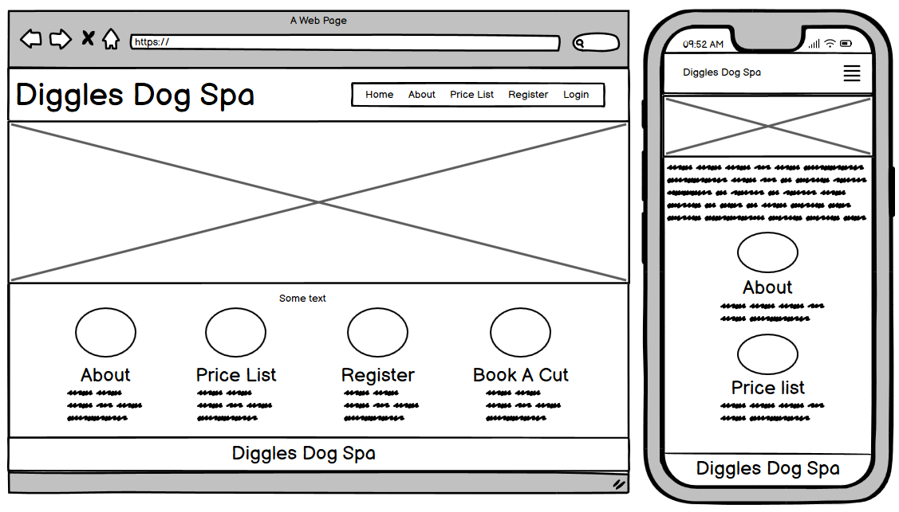

 

Create Account

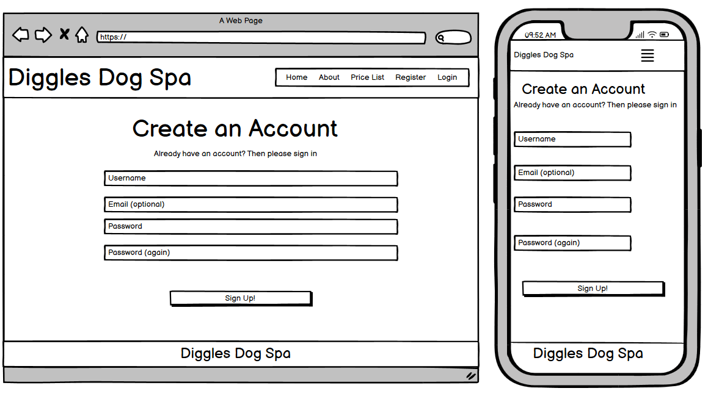

 

Sign In

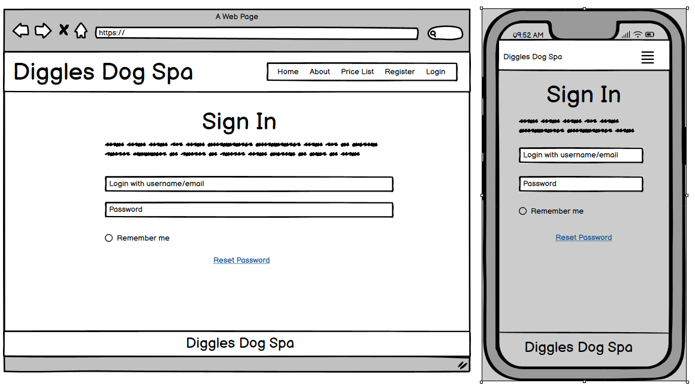

 

Book Your Pups Cut

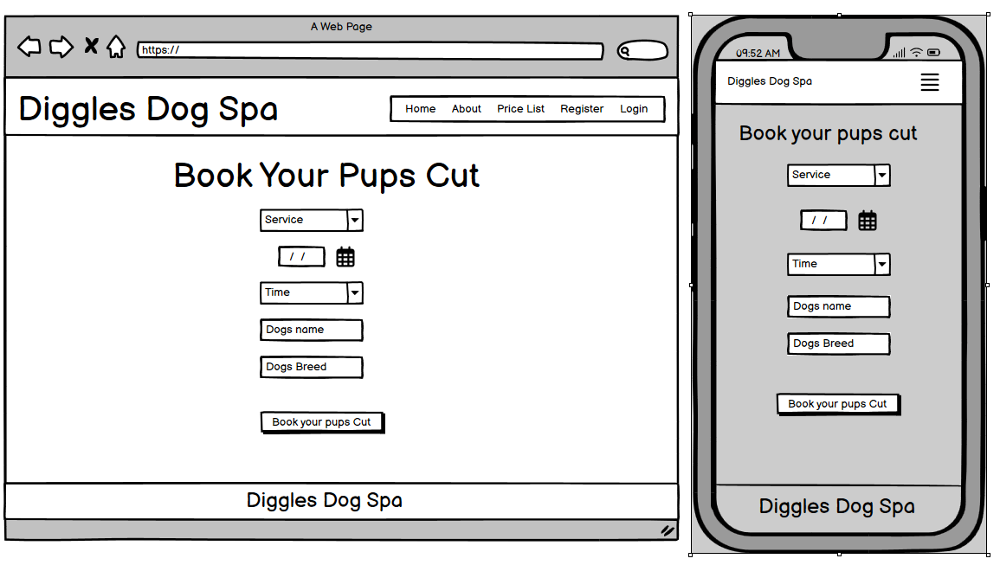

### Surface

#### Color Scheme and Fonts

- Me and my children have chosen the below colours for the website:

  - #F1DAC4 (a creamy beige)
  - #A69CAC (a soft lavender)
  - #474973 (a deep navy)

Colour Pallette

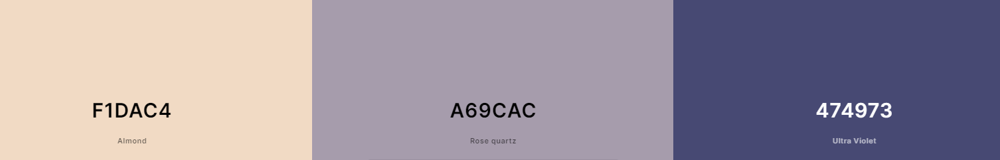

 

The beige makes the site feel warm and inviting, the lavender adds a hint of luxury, and the navy brings a serious, dependable feel. Together, these colors make the site look and feel cozy yet professional, perfect for Diggles dog spa.

### Font
madimi one has been used as the font throughout the website.

## Agile Development

The development of this project was managed through GitHub issues and projects and the work was done in sprints.

### Sprints

- Sprint 1

  - Setup CI template
  - Create user story template
  - Install packages
  - Create the project and app
  - setup database
  - Create base.html and navbar
  - Create footer with social media links

- Sprint 2

  - Create booking and services models
  - Create the pages used for the site
  - Install django allauth
  - Register an account
  - View available services
  - Create a booking
  - Cancel a booking
  - Edit a booking

- Sprint 3

  - Prevent Double bookings
  - Prevent bookings on past dates
  - Create custom 403 page
  - Create custom 404 page
  - Create custom 500 page

- Sprint 4

  - Create Admin Dashboard
  - Admin to be able to approve/reject bookings from the dashboard
  - Admin to be able to add/ remove services from the dashboard.
  - Testing
  - Readme
  - Submission

## Current Features

### Header and Navigation

Navbar with logo, website name, and links to all pages. On small to medium screens the navigation links are displayed as a burger menu with the links to other pages dropping down.

Desktop navbar for unregistered/logged out users

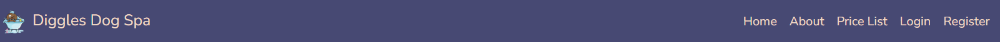

 

Desktop navbar for registered/logged in users

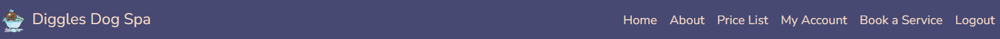

 

Desktop navbar for site administrators - Have a link to admin dashboard.

 

Navbar display on mobile devices

 

Navbar expanded on mobile devices

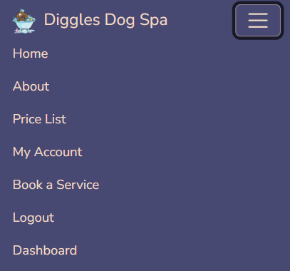

### Footer

Footer displaying social media icons as clickable links and copyright feature.

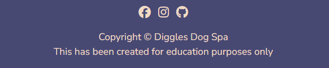

### Site pages

Home Page

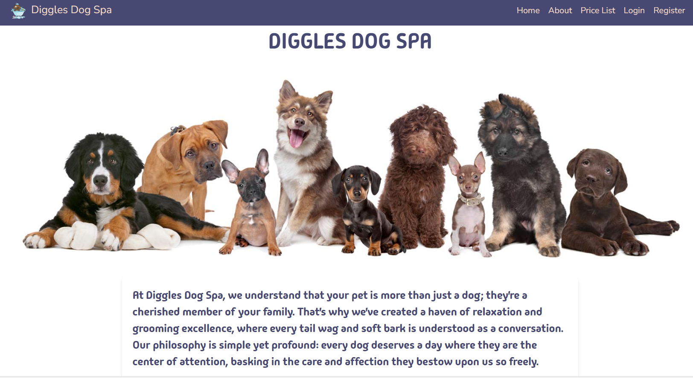

 

About Page

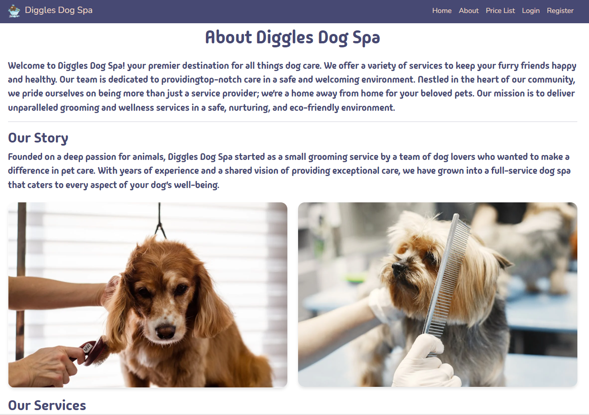

 

Price List Page

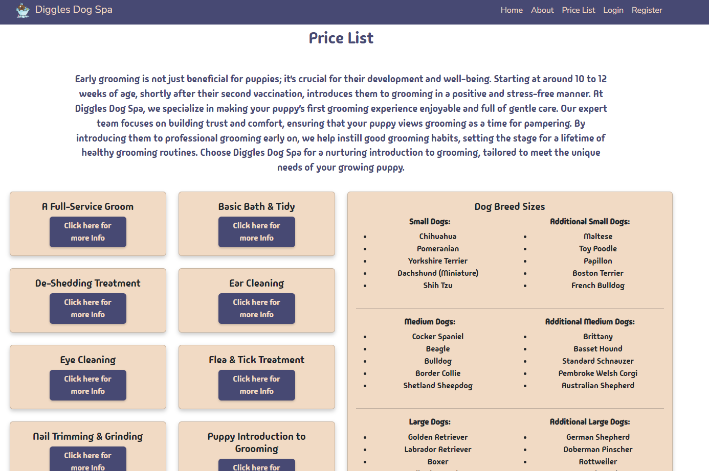

 

Register Page

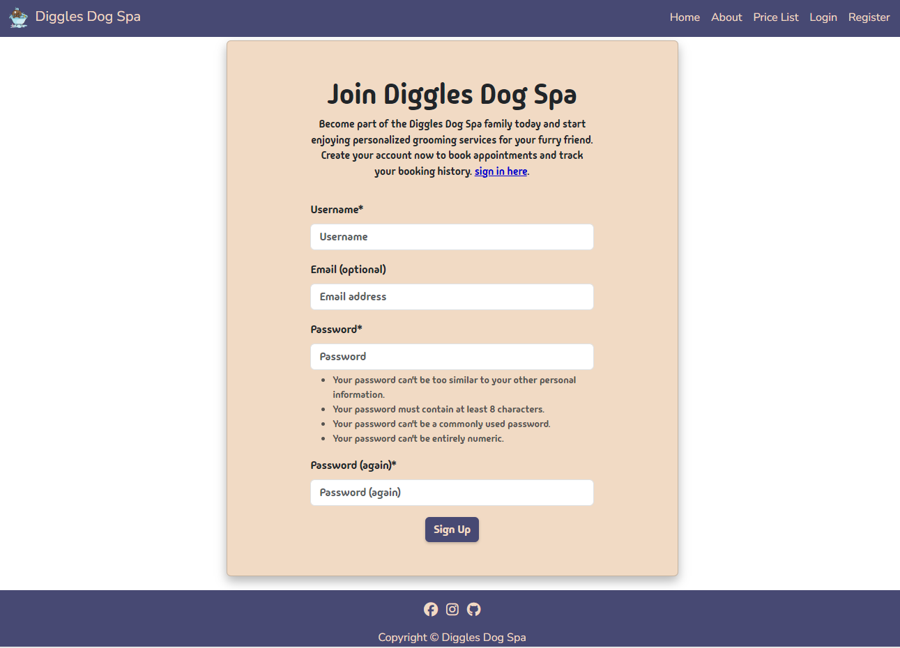

 

Login Page

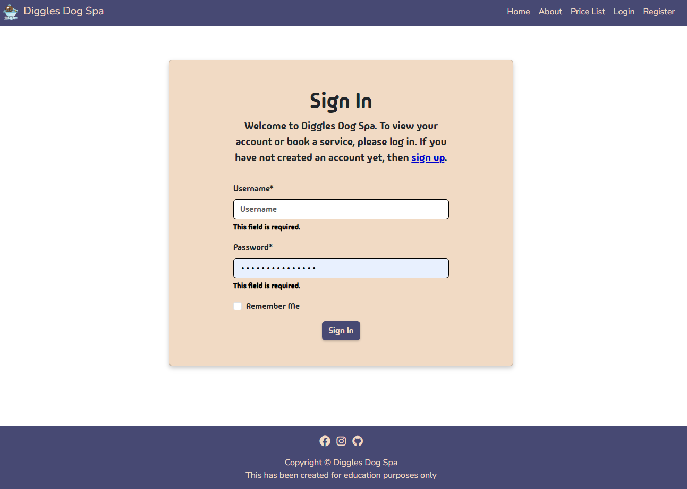

 

My Account Page

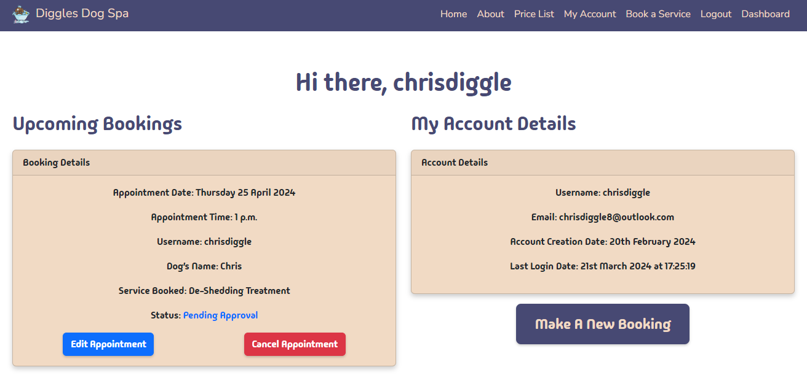

 

Book A Service Page

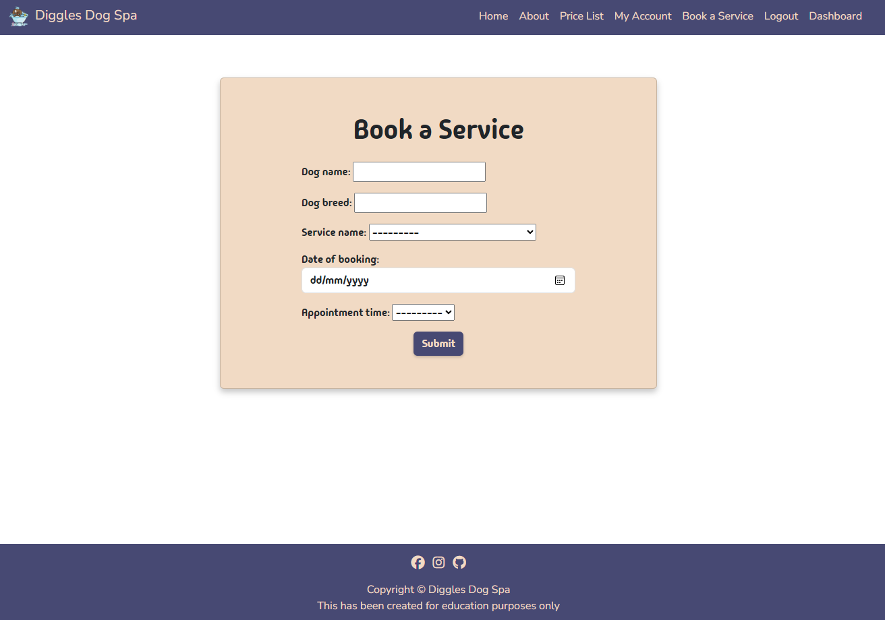

 

Admin Dashboard - Bookings and Pending Approvals

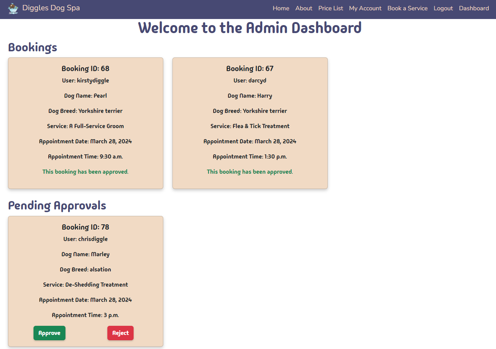

 

Admin Dashboard - Services

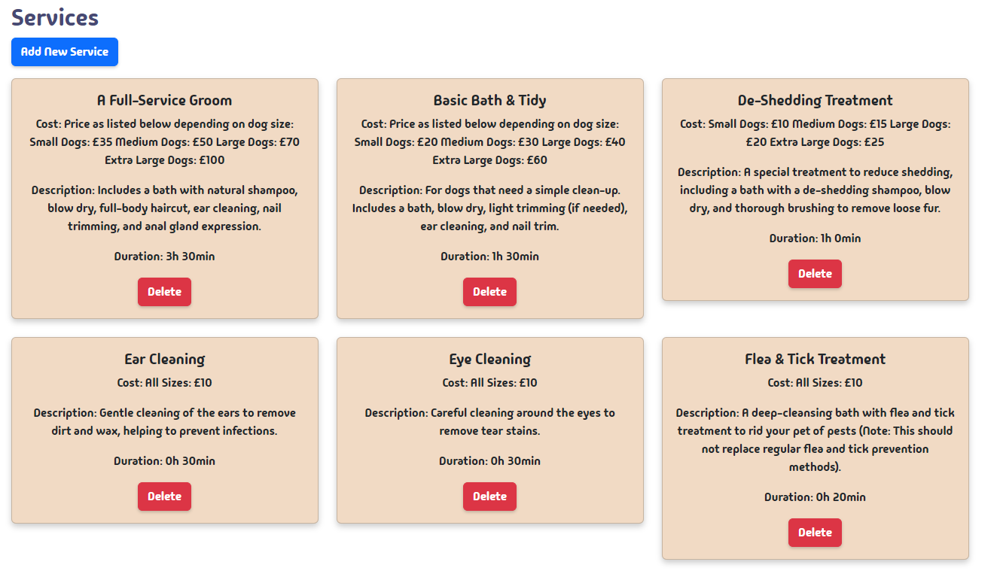

 

Add New Service Form

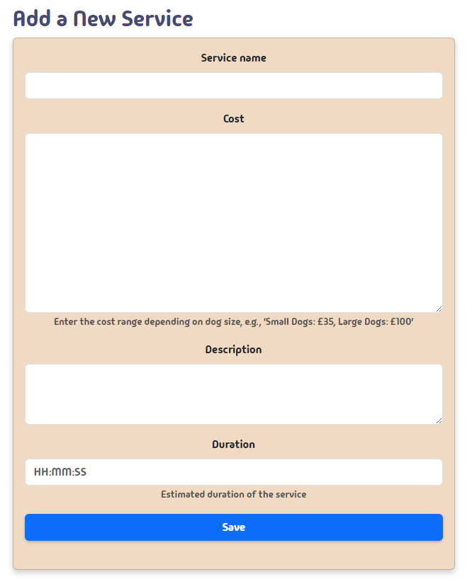

 

Logout

### Success Messages

Each time a user out a function on the website, either as part of the account functionality or the CRUD functionality, a success message will be displayed confirming that the function was carried out successfully and also error messages if the user tries to book appointments in the past or double book.

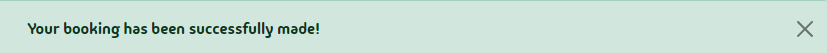

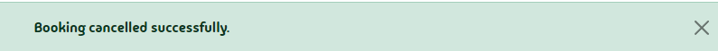

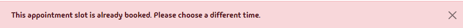

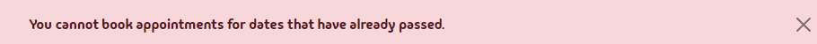

## Future Features

- Password Reset Option o allow the user to retrieve/reset their password if they have lost/forgotten it is also quite important and should be added for a more complete user experience.
- Automated emails for both admin and user when a new booking is requested and the user to be informed if the booking is approved or rejected.
- Capability to login with socal media accounts.
- Message on the booking card stating why the booking is rejected.
- Review features for the website
- The user to have the ability to delete their own account.

## Technologies Used

### Languages

- HTML
- CSS
- JavaScript
- Python

### Python Packages

- django - high-level Python web framework used to develop this application/site.
- psycopg2 - PostgreSQL database adapter for the Python programming language.
- dj3-cloudinary-storage - facilitates integration with Cloudinary by implementing Django Storage API.
- django-allauth - Integrated set of Django applications addressing authentication, registration, account management as well as 3rd party (social) account authentication.
- django-crispy-forms - provides a crispy filter and  tag that allows control of the rendering behavior of Django forms in a very elegant and DRY way.
- crispy-boostrap5 - Bootstrap4 template pack for django-crispy-forms.

### Frameworks & Tools

- Git - used for version control
- GitHub - used to host the source code of the website.
- Django - used to set up the back-logic and both custom models on the website.
- Gitpod -used to write and develop the code for the website, and for committing and pushing code to GitHub.
- Heroku - used to deploy the website
- Cloudinary - used to store the website media
- Bootstrap - used throughout the site for responsiveness, layout, and predefined style elements.
- Balsamiq - used to create the project wireframes.
- Lucid Chart - used for creating the ERD.
- Google Fonts - used to import fonts for the website.

## Testing and Validation

All the testing documentation can be found at [TESTING.md](TESTING.md)

## Deployment & Development

## Credits

### Media

### Code

## Acknowledgements