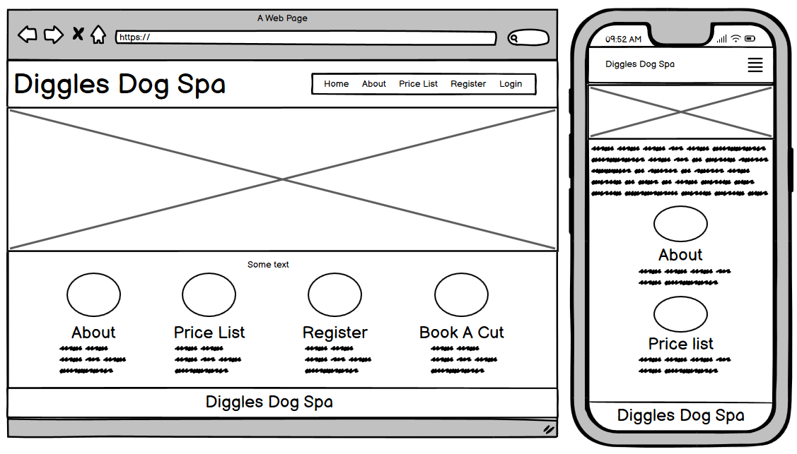
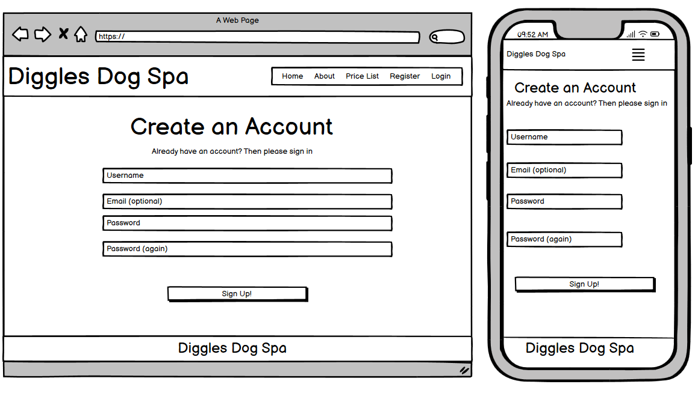
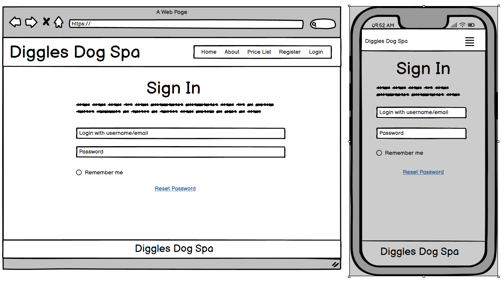
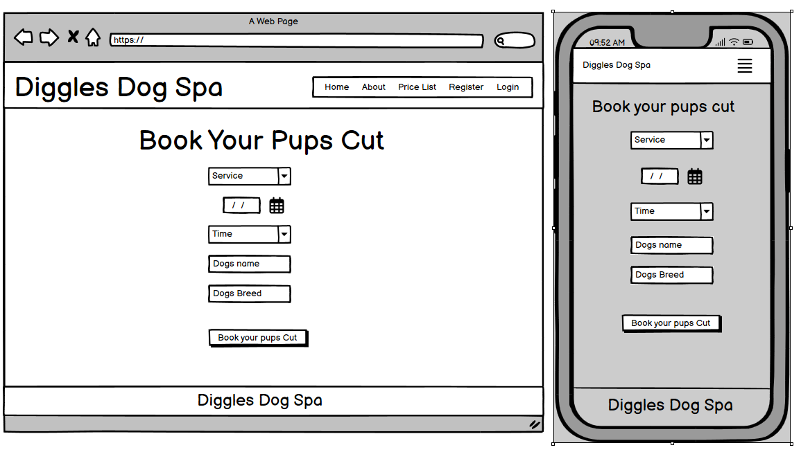
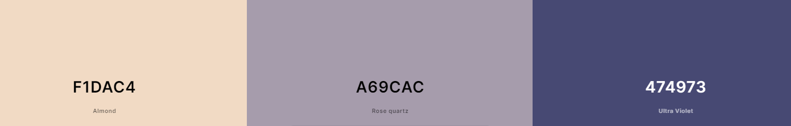

# Diggles Dog Spa

I am responsive image to go here

- [Live Site](https://diggles-dog-spa-4e32378de2f2.herokuapp.com/)
- [GitHub Repo](https://github.com/chrisdiggle1/diggles-dog-spa)

## Table of Content

- [Diggles Dog Spa](#diggles-dog-spa)
  - [Table of Content](#table-of-content)
  - [Introduction](#introduction)
    - [Project Goals](#project-goals)
    - [Data Base Design (ERD)](#data-base-design-(erd))
  - [User Experience - UX](#user-experience-ux)
    - [Strategy](#strategy)
    - [Scope](#scope)
    - [Structure](#structure)
    - [Skeleton](#skeleton)
    - [Surface](#surface)
  - [Agile Development](#agile-development)
  - [Current Features](#current-features)
  - [Future Features](#future-features)
  - [Technologies Used](#technologies-used)
    - [Languages](#languages)
    - [Python Packages](#python-packages)
    - [Frameworks & Tools](#frameworks--tools)
  - [Testing and Validation](#testing-and-validation)
  - [Deployment & Development](#deployment--development)
  - [Credits](#credits)
    - [Media](#media)
    - [Code](#code)
  - [Acknowledgements](#acknowledgements)

## Introduction

### Project Goals

### Data Base Design (ERD)

The The Entity Relationship Diagram (ERD) illustrates the structure of the database which lies at the core of the functionality of the site:

## User Experience - UX

### Strategy

#### Target Audience

The target audience is for dog owners seeking an easy and effeicient way to book there their dog in for grooming appointments. This is for customers looking for a hassle-free online experience to access a variety of grroming treatments, from basic hygiene maintenance to luxurious pampering sessions for their dogs. The customers appreciate the ability to create a persoanl account form managing appointments and tracking their dog's grooming history. Our service is designed for those who see their pets as family members and are committed to their well-being and appearence.

| EPIC                       | ID  | User Story |
| -------------------------- | --- | -----------|
| **CONTENT AND NAVIGATION** |     |            |
|                            | 1A  | As a site visitor I can view the site menu so that easily navigate through the site. |
|                            | 1B  | As a site visitor I can see the relevant information so that I can decide if I want to register for an account and become a customer. |
|                            | 1C  | As a site visitor I can access different pages on the site so that I can smoothly navigate through the functionality of the site. |
|                            | 1D  | As a customer I can view detailed information about each grooming service so that I can make a decision on what service I would like my dog to have. |
|                            | 1E  | As a site visitor I can **click and view the sites social media ** so that I can view more information via social media. |
| **REGISTRATION AND USER ACCOUNTS** |     |            |
|                            | 2A  | As a customer I can create an account so that I can book my dog in for different grooming services. |
|                            | 2B  | As a customer I can use my created account information so that I can log into my account and access my information. |
|                            | 2C  | As a customer I can log out of my account so that my personal information is protected. |
| **MANAGING BOOKINGS**      |     |           |
|                            | 3A  | As an authenticated user I can book a grooming service for my dog so that my dog can receive professional grooming care. |
|                            | 3B  | As an authenticated user I can cancel a booking so that The booking is cancelled if we can no longer make it. |
| **ADMIN CAPABILITIES**     |     |           |
|                            | 4A  | As an admin I can view, confirm, and cancel bookings so that I can manage the grooming schedule efficiently. |
|                            | 4B  | As an admin I can add a new grooming service to the website so that customers have a variety of options to choose from. |

### Scope

### Structure

### Skeleton

#### Wireframes

[Balsamiq Wireframes](https://balsamiq.com/) was used to created the below wireframes for mobile and desktop devices.

Home Page

 

Create Account

 

Sign In

 

Book Your Pups Cut

### Surface

#### Color Scheme and Fonts

- Me and my children have chosen the below colours for the website:

  - #F1DAC4 (a creamy beige)
  - #A69CAC (a soft lavender)
  - #474973 (a deep navy)

Colour Pallette

 

The beige makes the site feel warm and inviting, the lavender adds a hint of luxury, and the navy brings a serious, dependable feel. Together, these colors make your site look and feel cozy yet professional, perfect for a dog spa.

## Agile Development

## Current Features

## Future Features

## Technologies Used

### Languages

### Python Packages

### Frameworks & Tools

## Testing and Validation

## Deployment & Development

## Credits

### Media

### Code

## Acknowledgements