# Diggles Dog Spa Testing

[Return to the README](README.md)

- [Performance](#performance)
- [Accessibility](#accessibility)
- [Code Validation](#code-validation)
  - [HTML Validation](#html-validation)
  - [CSS Validation](#css-validation)
  - [JS Validation](#js-validation)
  - [PEP8 Validation](#python-code-validation)
- [Testing](#testing)
  - [Manual Testing](#manual-testing)
  - [Automated Testing](#automated-testing)
- [Browser Testing](#browser-testing)
- [Bugs & Fixes](#bugs-and-fixes)

## Performance

[Google Lighthouse](https://developer.chrome.com/docs/lighthouse/overview/) was used to test the performance, accessibility, best practices and SEO of the website on mobile and desktop.

### Desktop

Home Page

 

About Page

 

Price List Page

 

My Account Page

 

Book A Service Page

 

Dashboard Page

 

Login Page

 

Logout Page

 

Register Page

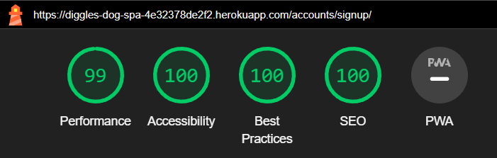

 

### Mobile

Home Page

 

About Page

 

Price List Page

 

My Account Page

 

Book A Service Page

 

Dashboard Page

 

Login Page

 

Logout Page

 

Register Page

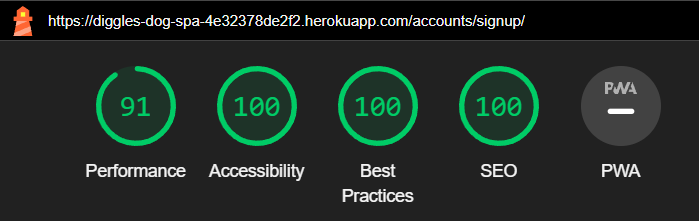

 

## Accessibility

The [WAVE WebAIM web accessibility evaluation tool](https://wave.webaim.org/) was used to ensure the website meets accessibility standards.

There are no errors on the WAVE tests:

Home Page

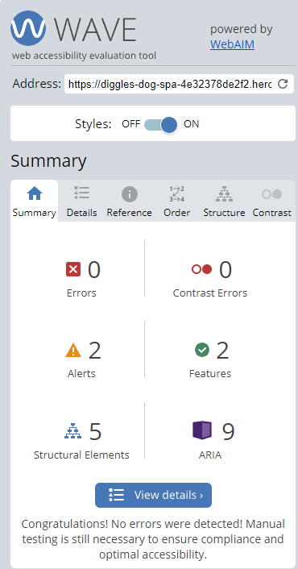

 

About Page

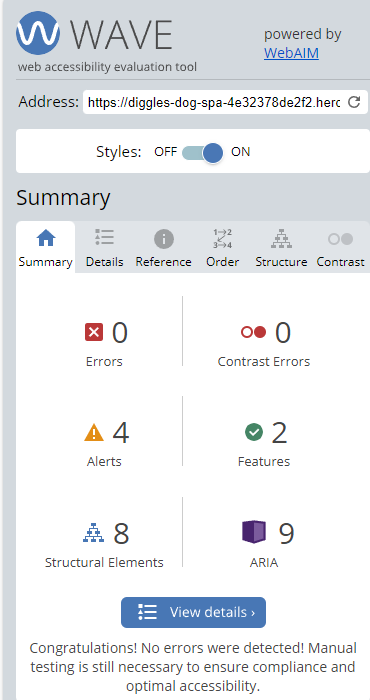

 

Price List Page

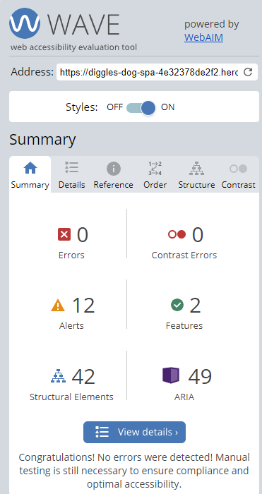

 

Login Page

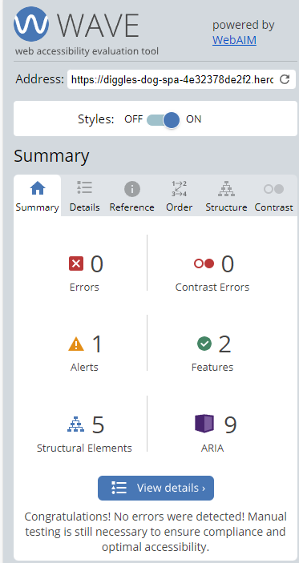

 

Logout Page

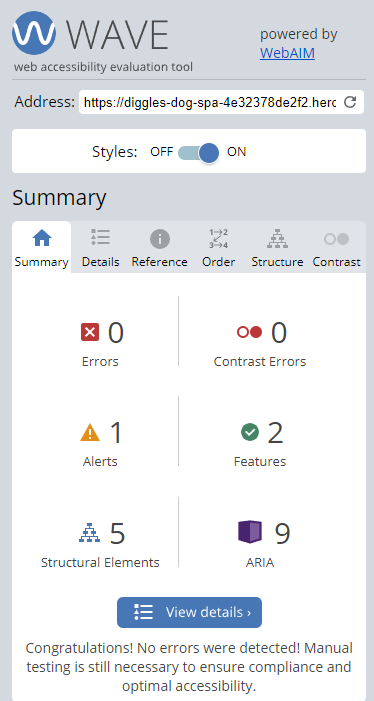

 

Register Page

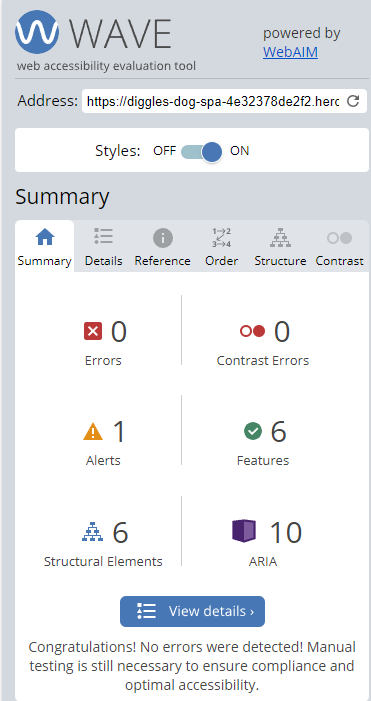

 

## Code Validation

### HTML Validation

The [W3C Markup Validation Service](https://validator.w3.org/) was used to validate the HTML of the website.

All the site pages were tested with no errors or warnings to show:

Home Page

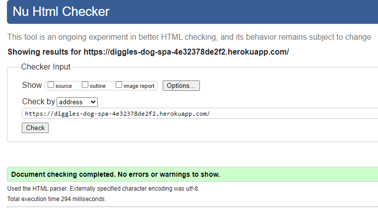

 

About Page

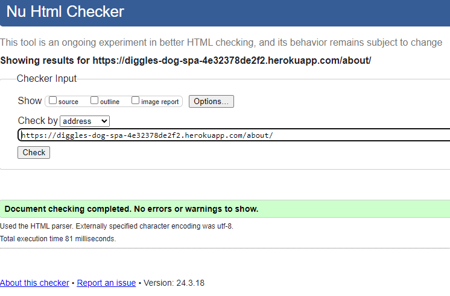

 

Price List Page

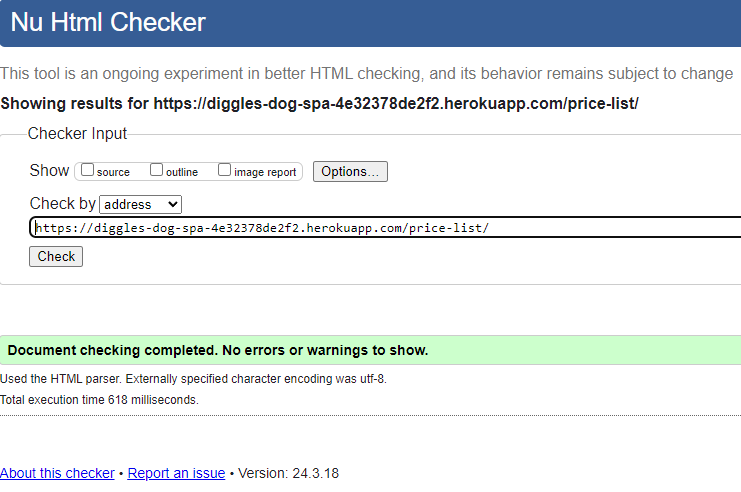

 

My Account Page

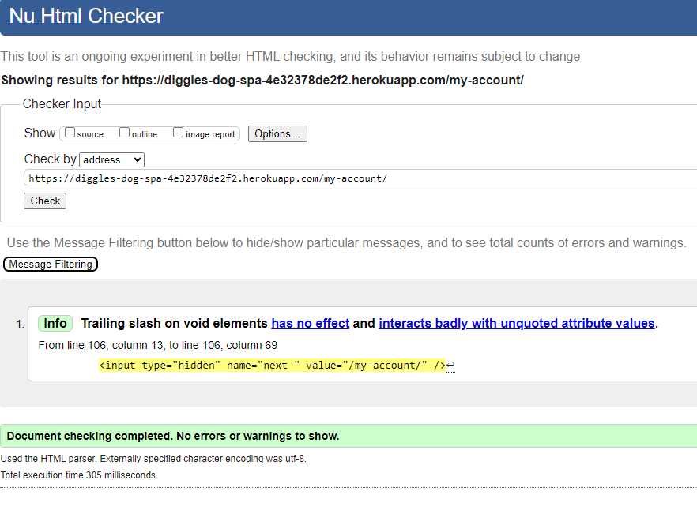

 

Book A Service Page

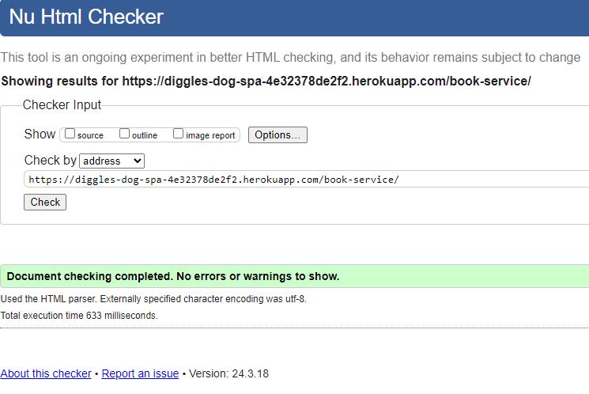

 

Dashboard Page

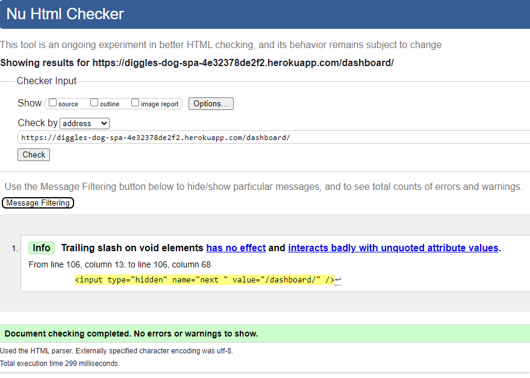

 

Login Page

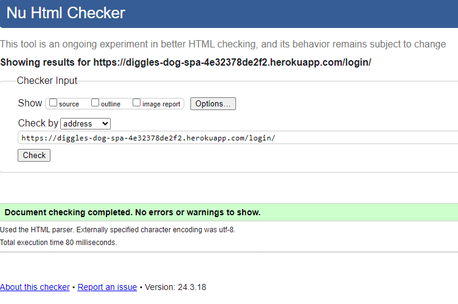

 

Logout Page

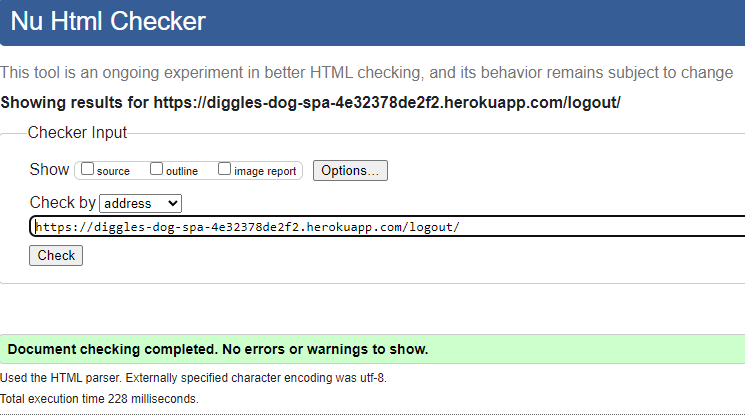

 

Register Page

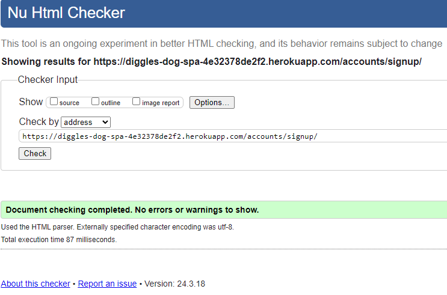

 

### CSS Validation

The [W3C Jigsaw CSS Validation Service](https://jigsaw.w3.org/css-validator/) was used to validate the `style.css` file used in the website.

CSS Validation

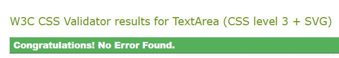

 

### JS Validation

[JSHint](https://jshint.com/) was used to validate the one JavaScript function used in the website for automatically closing message alerts after 5 seconds. No errors were found in this function.

JS Validation

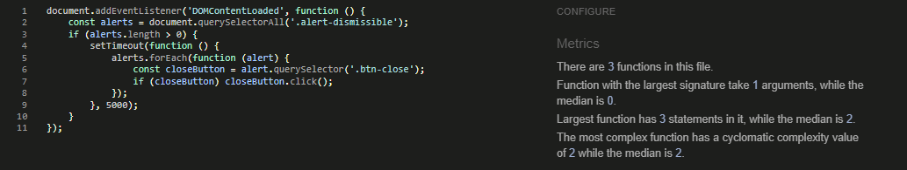

 

### Python Code Validation (PEP8 Compliant)

The [CI Python Linter](https://pep8ci.herokuapp.com/) was used to validate the Python code used in this project:

admin.py

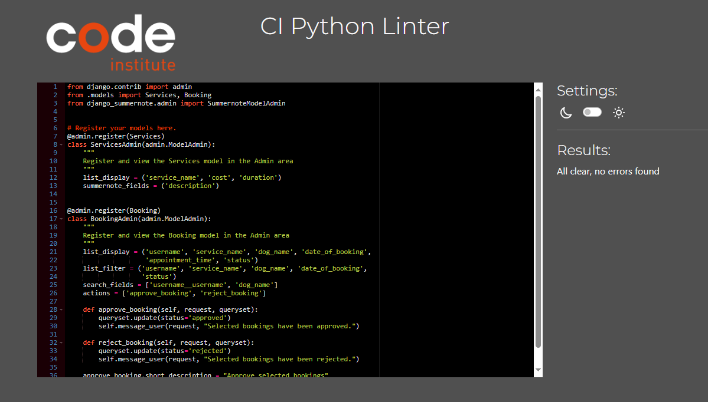

 

apps.py

 

forms.py

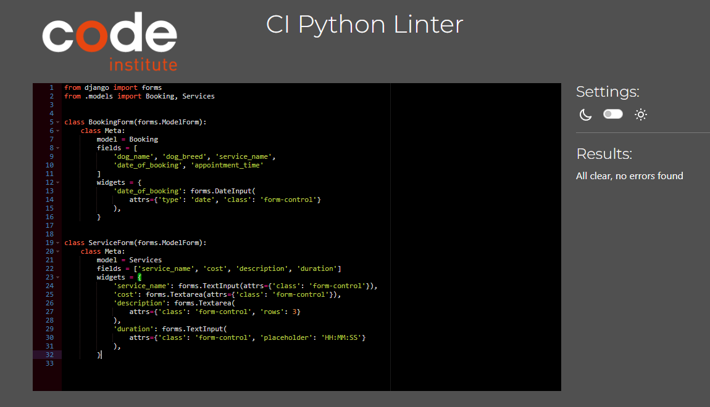

 

models.py

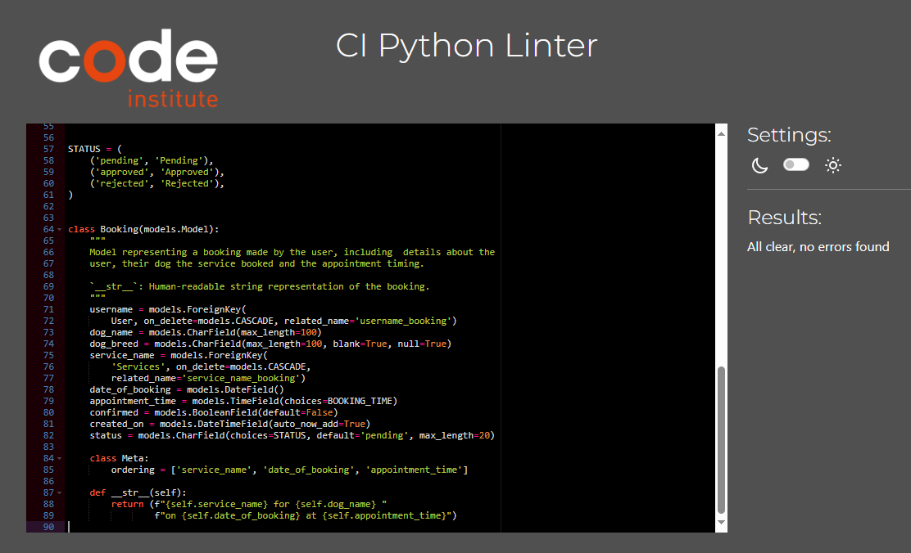

 

urls.py

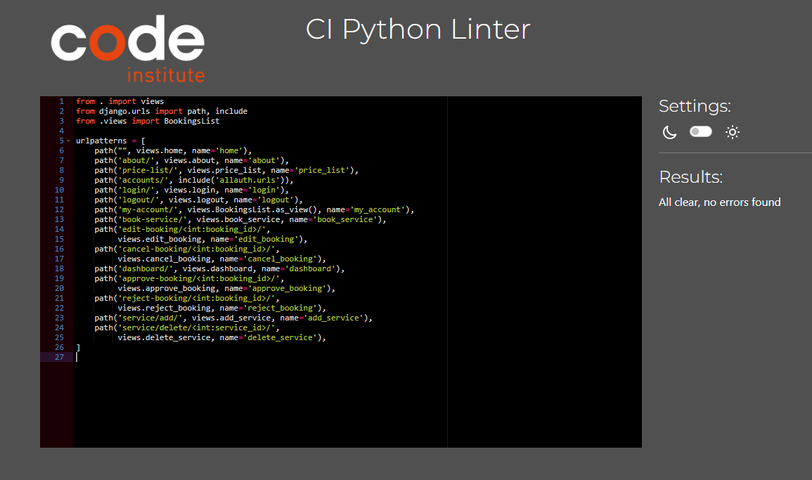

 

views.py

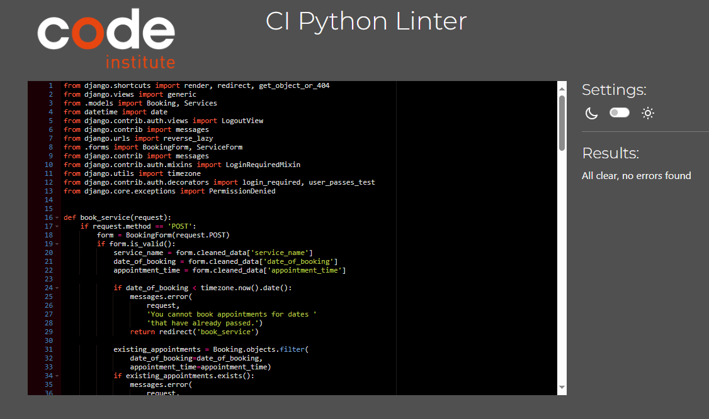

 

## Testing

### Manual Testing

Behavior-driven development (BDD) is an Agile software development methodology in which an application is documented and designed around the behavior a user expects to experience when interacting with it. This process is used to test user stories in a non-technical way, allowing anyone to test the features of an app.

**EPIC: Site navigation and content**
| ID | User Story | Action/Expected Results | Pass |
| -- | ---------- | ----------------------- | ---- |
| 1A | As a site visitor I can view the site menu so that easily navigate through the site. | A visitor to the site can see a navigation bar in the header. The navbar has links to all the pages of the website. When clicking on the disered link the relevant page opens. Clicking on the title takes the user back to the homepage. When the site is viewed on smaller devices, a navbar toggler (burger menu) is displayed and when clicked, the site links drop down and take you to the desired page when clicked | :white_check_mark: |
| 1B | As a site visitor I can see the relevant information so that I can decide if I want to register for an account and become a customer. | For first time users who aren't registered, the home screen is displayed with a main image and a paragraph to obtain the visiors attention and shows the purpose of the site. The visitor can view the 'about' page with details about the dog spa and a list of sevices provided. There is a price List page which displays each service and a list of dog breeds in the size category. | :white_check_mark: |
| 1C | As a site visitor I can access different pages on the site so that I can smoothly navigate through the functionality of the site. | All the pages on the site can be clciked and taken to the desired page. the pages have been designed with good UX in mind. The pages are uncluttered and the content matches the link. | :white_check_mark: |
| 1D | As a customer I can view detailed information about each grooming service so that I can make a decision on what service I would like my dog to have. | The visitor can view the 'price list' page where each service is displayed as a seperate card with a button to click to view more information, when clicking this a modal appears with a description of the service, cost and duration. the user can then click to close the modal or click 'login to book' which will take them to the 'login' page with also a link to sign up if not registered. This page also displays a list of in their size category. | :white_check_mark: |
| 1E | As a site visitor I can click and view the sites social media so that I can view more information via social media. | The site visitor can click on the social media icons in the footer and that will take them to the selected social media website. | :white_check_mark: |
