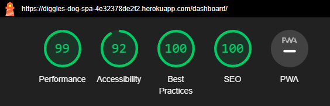

# Diggles Dog Spa Testing

[Return to the README](README.md)

- [Performance](#performance)
- [Accessibility](#accessibility)
- [Code Validation](#code-validation)
  - [HTML Validation](#html-validation)
  - [CSS Validation](#css-validation)
  - [JS Validation](#js-validation)
  - [PEP8 Validation](#python-code-validation)
- [Testing](#testing)
  - [Manual Testing](#manual-testing)
  - [Automated Testing](#automated-testing)
- [Browser Testing](#browser-testing)
- [Bugs & Fixes](#bugs-and-fixes)

## Performance

[Google Lighthouse](https://developer.chrome.com/docs/lighthouse/overview/) was used to test the performance, accessibility, best practices and SEO of the website on mobile and desktop.

### Desktop

Home Page

 

About Page

 

Price List Page

 

My Account Page

 

Book A Service Page

 

Dashboard Page

 

Login Page

 

Logout Page

 

### Mobile

Home Page

 

About Page

 

Price List Page

 

My Account Page

 

Book A Service Page

 

Dashboard Page

 

Login Page

 

Logout Page

 